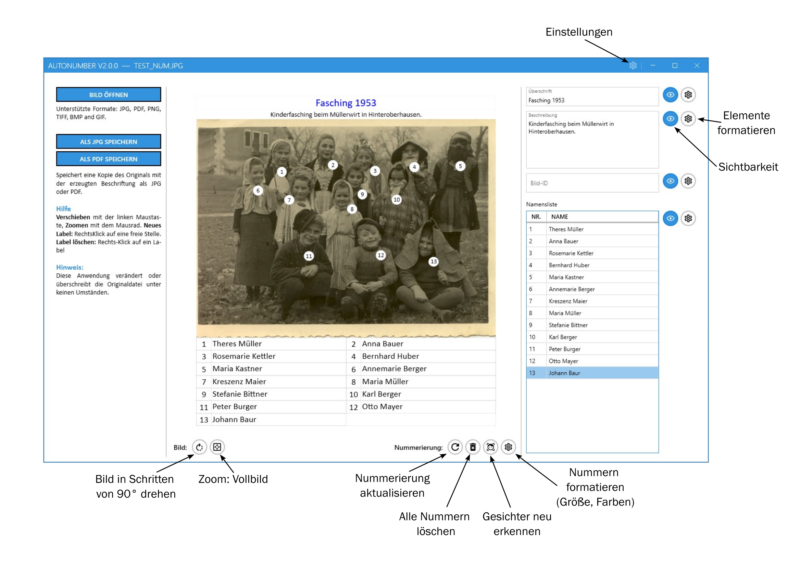

# AutoNumber

**AutoNumber** hilft Genealogen, Personen auf Gruppenfotos zu identifizieren, indem es automatisch Gesichter erkennt, nummerierte Markierungen darauf platziert und diese Nummern mit einer Namensliste verknüpft — alles als JPG oder bearbeitbares PDF exportierbar.

---

## Funktionen

- **Automatische Gesichtserkennung** — öffnet ein Bild und nummeriert erkannte Gesichter sofort.
- **Manuelle Kontrolle** — Rechtsklick auf einen leeren Bereich fügt eine Nummer hinzu; Rechtsklick auf eine bestehende Nummer löscht diese.
- **Neu nummerieren** — sortiert Markierungen nach einem zeilenbasierten Algorithmus, während Namenzuordnungen erhalten bleiben.
- **Namensliste** — geben Sie neben jeder Nummer einen Namen ein; die Liste ist in jedem Export enthalten.
- **Titel, Beschreibung & Bild-ID** — versehen Sie das Bild mit Metadaten (z. B. Archivbezeichnung), die mit der Datei reisen.
- **Als JPG speichern** — flaches Bild mit Markierungen und Textblöcken, bereit zum Teilen oder Drucken.
- **Als PDF speichern** — bearbeitbares PDF, das in AutoNumber erneut geöffnet und weiter bearbeitet werden kann.
- **Optionale CSV- und/oder JSON-Metadaten** — speichert eine Begleitdatei `.csv`/`.json` zur Verwendung in Excel, Datenbanken oder Archivsystemen.
- **Anpassbares Erscheinungsbild** — Schriftart, Farbe und Größe für jedes Element; Elemente können einzeln ausgeblendet werden.
- **Breite Formatunterstützung** — JPG, PNG, TIFF, BMP, GIF Eingabe; zuvor gespeicherte JPG- und PDF-Dateien können erneut geöffnet und bearbeitet werden.

---

## Benutzeroberflächen-Übersicht

Das Fenster ist in drei Spalten unterteilt:

| Spalte | Inhalt |
|--------|--------|
| **Links** | Bild öffnen · Als JPG speichern · Als PDF speichern · Schnellhilfe-Notizen |
| **Mitte** | Bildvorschau mit nummerierten Markierungen · Aktionsschaltflächen (drehen, vergrößern, neu nummerieren, erkennen, formatieren) |
| **Rechts** | Titel · Beschreibung · Bild-ID · Namensliste (Nummer / Name) |

---

## Schnelleinstieg

1. Klicken Sie auf **Bild öffnen** (linke Spalte), um ein Foto zu laden.
2. Drehen Sie das Bild bei Bedarf — jeder Klick dreht es **90° im Uhrzeigersinn**.
3. Gesichter werden erkannt und automatisch nummeriert.
4. Füllen Sie die **Namensliste** auf der rechten Seite aus.
5. Fügen Sie optional einen **Titel**, **Beschreibung** und **Bild-ID** hinzu.
6. Speichern Sie das Ergebnis als **JPG** oder **PDF**.

---

## Arbeiten mit Markierungen

| Aktion | Wie |
|--------|-----|
| Markierung manuell hinzufügen | Rechtsklick auf einen leeren Bereich des Bildes |
| Markierung löschen | Rechtsklick auf die Markierung |
| Markierung verschieben | Ziehen Sie sie an die gewünschte Position |
| Alle Markierungen neu nummerieren | Klicken Sie auf **Neu nummerieren** (zeilenbasierte Ordnung) |
| Neu beginnen | Klicken Sie auf **Alle löschen**, dann platzieren Sie Markierungen manuell oder klicken Sie auf **Gesichter erkennen** |

> **Hinweis:** Das Neu-Nummerieren und die Gesichtserkennung bewahren Namenzuordnungen soweit möglich, aber das Löschen aller Markierungen löscht die Namensliste. Ein Bestätigungsdialog erscheint, wenn bestehende Namen verloren gehen könnten.

---

## Einstellungen

Öffnen Sie den Dialog **Einstellungen** (Zahnrad-Symbol, oben rechts):

- **Reiter „Schriftarten"** — legen Sie die Standard-Schriftgrößen (in Prozent), Farben und Stile für neue Bilder fest. Nützlich zum Standardisieren einer Serie ähnlicher Fotos.
- **Reiter „Speichern"** — konfigurieren Sie Dateiname-Suffixe (z. B. `_num`), damit Original- und verarbeitete Dateien klar getrennt bleiben.

---

## Tipps für Genealogen

- Klären Sie die **Rotation** vor der Eingabe von Namen.
- Verwenden Sie das Feld **Bild-ID** für Archivbezeichnungen oder Albumseitennummern.
- Halten Sie Namenseinträge kurz und konsistent (z. B. *Anna Müller, geb. 1904*).
- Speichern Sie als PDF, wenn einige Personen noch nicht identifiziert sind — die Datei bleibt bearbeitbar.
- Die **CSV-Begleitdatei** ermöglicht es Ihnen, eine Datenbank nach Namen zu durchsuchen und die Bild-ID und Markierungsnummer zu finden, um die Person im Foto zu lokalisieren.

---

## Abhängigkeiten

Die Software benötigt das **.NET 8.0**-Framework. Falls die automatische Installation fehlschlägt, laden Sie es manuell von [Microsofts Website](https://dotnet.microsoft.com/de-de/download/dotnet/8.0) herunter.

Verwendete Drittanbieter-Bibliotheken:

| Bibliothek | Zweck | Lizenz |
|------------|-------|--------|
| **Emgu.CV.WPF** | OpenCV-Wrapper für .NET | [BSD 3-Clause](https://github.com/emgucv/emgucv/blob/master/LICENSE) |
| **Emgu.CV.Windows** | Windows-spezifische OpenCV-Bindungen | [BSD 3-Clause](https://github.com/emgucv/emgucv/blob/master/LICENSE) |
| **Extended.WPF.Toolkit** | WPF-UI-Komponenten | [MS-PL](https://github.com/xceedsoftware/wpftoolkit/blob/master/license.md) |

Siehe [THIRD_PARTY_LICENCES.md](THIRD_PARTY_LICENCES.md) für vollständige Details.

---

## Lizenz

Dieses Projekt ist unter der MIT-Lizenz lizenziert. Siehe die Datei [LICENSE](LICENSE.txt) für Details.

## Kontakt

Für Support oder Fragen öffnen Sie bitte ein Ticket im GitHub-Issue-Tracker.
