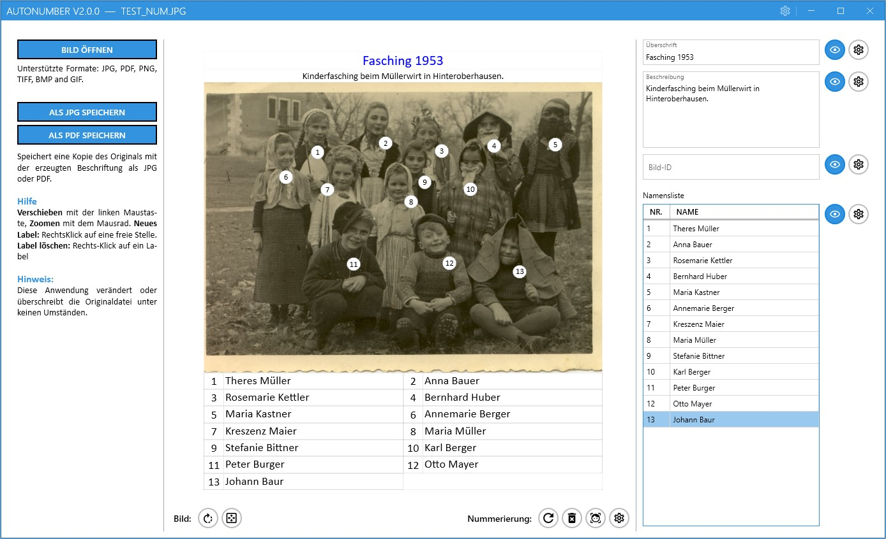

# AutoNumber

**AutoNumber** helps genealogists identify people in group photos by automatically detecting faces, placing numbered markers on them, and pairing those numbers with a name list — all exportable as JPG or editable PDF.

---

## Features

- **Automatic face detection** — opens an image and numbers detected faces immediately.
- **Manual control** — right-click a blank area to add a number; right-click an existing number to remove it.
- **Re-numbering** — reorders markers using a row-based algorithm while preserving name assignments.
- **Name list** — type a name next to each number; the list is included in every export.
- **Title, description & image ID** — attach metadata (e.g. archive signature) that travels with the file.
- **Save as JPG** — flat image with markers and text blocks, ready to share or print.
- **Save as PDF** — editable PDF that can be reopened in AutoNumber for further editing.
- **Optional CSV and/or JSON metadata** — saves a sidecar `.csv`/`.json`  file for use in Excel, databases, or archival systems.
- **Customisable appearance** — per-element font, colour and size settings; elements can be hidden individually.
- **Broad format support** — JPG, PNG, TIFF, BMP, GIF input; previously saved JPG and PDF files can be reopened and edited.

---

## UI Overview

The window is divided into three columns:

| Column | Contents |
|--------|----------|
| **Left** | Open image · Save as JPG · Save as PDF · Quick-help notes |
| **Centre** | Image preview with numbered markers · Action buttons (rotate, zoom, re-number, detect, format) |
| **Right** | Title · Description · Image ID · Name list (number / name) |

---

## Quick Start

1. Click **Open image** (left column) to load a photo.
2. Rotate the image if needed — each click turns it **90° clockwise**.
3. Faces are detected and numbered **automatically**.
4. Fill in the **name list** on the right.
5. Optionally add a **title**, **description**, and **image ID**.
6. Save the result as **JPG** or **PDF**.

---

## Working with Markers

| Action | How |
|--------|-----|
| Add a marker manually | Right-click on an empty area of the image |
| Delete a marker | Right-click on the marker |
| Move a marker | Drag it to the desired position |
| Re-number all markers | Click **Re-number** (row-based order) |
| Start over | Click **Delete all**, then place markers manually or click **Detect faces** |

> **Note:** Re-numbering and face detection preserve name assignments where possible, but deleting all markers clears the name list. A confirmation dialog appears whenever existing names could be lost.

---

## Settings

Open the **Settings** dialog (gear icon, top-right):

- **Fonts tab** — set default font sizes (as a percentage), colours, and styles for new images. Useful for standardising a series of similar photos.
- **Save tab** — configure filename suffixes (e.g. `_num`) so originals and processed files stay clearly separated.

---

## Tips for Genealogy

- Sort out **rotation** before entering names.
- Use the **image ID** field for archive signatures or album page references.
- Keep name entries short and consistent (e.g. *Anna Müller, b. 1904*).
- Save as PDF when some people are still unidentified — the file remains editable.
- The **CSV sidecar** lets you search a database by name and retrieve the image ID and marker number to locate the person in the photo.

---

## Dependencies

The software requires the **.NET 8.0** framework. If the automatic installation fails, download it manually from [Microsoft's website](https://dotnet.microsoft.com/en-us/download/dotnet/8.0).

Third-party libraries used:

| Library | Purpose | License |
|---------|---------|---------|
| **Emgu.CV.WPF** | OpenCV wrapper for .NET | [BSD 3-Clause](https://github.com/emgucv/emgucv/blob/master/LICENSE) |
| **Emgu.CV.Windows** | Windows-specific OpenCV bindings | [BSD 3-Clause](https://github.com/emgucv/emgucv/blob/master/LICENSE) |
| **Extended.WPF.Toolkit** | WPF UI components | [MS-PL](https://github.com/xceedsoftware/wpftoolkit/blob/master/license.md) |

See [THIRD_PARTY_LICENCES.md](THIRD_PARTY_LICENCES.md) for full details.

---

## License

This project is licensed under the MIT License. See the [LICENSE](LICENSE.txt) file for details.

## Contact

For support or questions, please open an issue on the GitHub issue tracker.
