# AutoNumber – User Manual

*[Deutsche Version](HANDBUCH_DE.md)*

*Note: AutoNumber's user interface is German-only, so the screenshots below show German menu and button labels. This manual explains what each one does.*

## Table of Contents

1. [Introduction](#1-introduction)
2. [Interface Overview](#2-interface-overview)
3. [Quick Start](#3-quick-start)
4. [Opening an Image](#4-opening-an-image)
5. [Toolbar](#5-toolbar)
6. [Faces & Numbering](#6-faces--numbering)
7. [Name List](#7-name-list)
8. [Title, Description, Image ID](#8-title-description-image-id)
9. [Saving & Export](#9-saving--export)
10. [Settings](#10-settings)
11. [CSV/JSON Metadata Export](#11-csvjson-metadata-export)
12. [Tips for Genealogy Research](#12-tips-for-genealogy-research)
13. [Frequently Asked Questions (FAQ)](#13-frequently-asked-questions-faq)
14. [Installation](#14-installation)
15. [Appendix](#15-appendix)

---

## 1. Introduction

AutoNumber helps you

- automatically detect faces in photos and mark them with numbers,
- place numbers manually directly on the image,
- maintain a matching name list,
- and save the result as a **JPG** or an **editable PDF**.

This lets you quickly prepare family photos, class pictures, or group shots for your genealogy work.

---

## 2. Interface Overview

At the top of the window is the menu bar with the **File** and **Help** menus. Below it, the interface is divided into two areas:

1. **Left: Image preview**
   - Shows the photo with numbers and additional text.
   - Below it are the action groups **Image** (rotate, zoom) and **Numbering** (row mode, delete all, redetect faces, formatting).

2. **Right: Text and list area**
   - Title
   - Description/image information
   - Image ID
   - Name list (No. / Name)

Every block on the right has an eye icon to show/hide it and a gear icon to format it.

The **File** menu holds all actions for opening, saving, and exporting (see [Chapter 4](#4-opening-an-image) and [Chapter 9](#9-saving--export)) as well as access to **Settings** (see [Chapter 10](#10-settings)). The **Help** menu links to this manual.

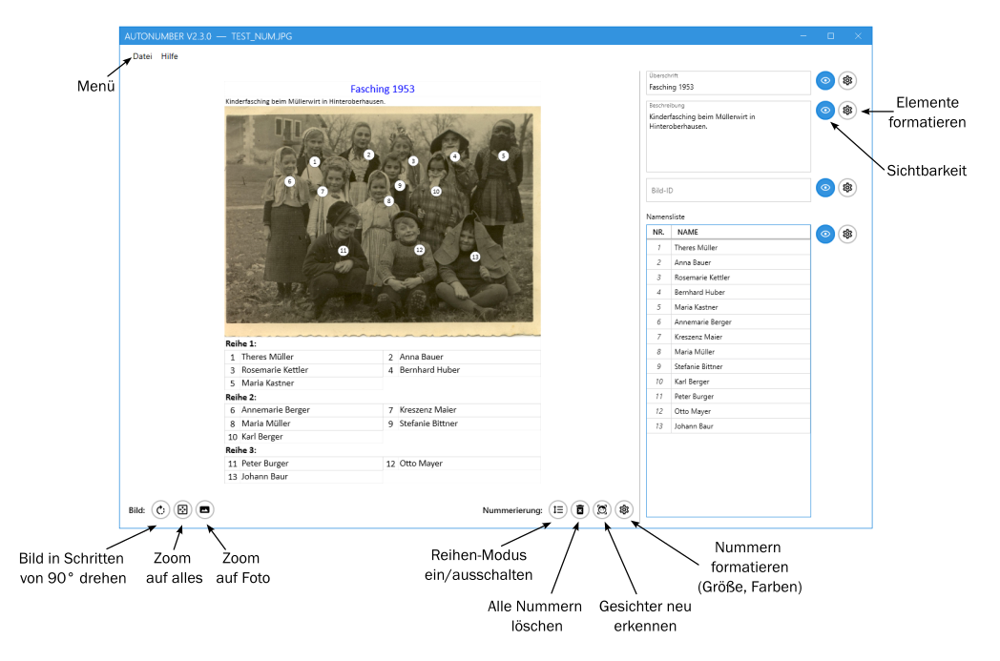

---

## 3. Quick Start

1. Choose **File → Open...** and select an image.
2. Use **Rotate** (button below the preview) to orient the image correctly, if needed.
3. Faces are detected and numbered automatically.
4. Fill in the **name list** on the right, matching names to numbers.
5. Optionally add a title, description, and image ID.
6. Save the result via **File → Save As...** as **JPG** or **PDF**.

---

## 4. Opening an Image

- Choose **File → Open...**.
- Supported formats: JPG, PDF, PNG, TIFF, BMP, GIF.
- Face detection starts automatically after opening (if enabled in Settings).
- JPG or PDF files previously saved with AutoNumber can also be opened here – layout, visibility, and font sizes are restored (see [Chapter 9](#9-saving--export)).

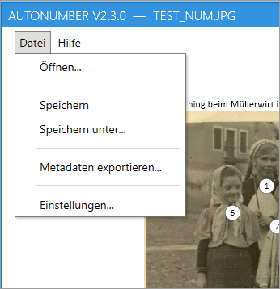

---

## 5. Toolbar

Below the image preview there are two tool groups: **Image** (zoom and rotate) and **Numbering** (row mode, delete all, redetect faces, formatting). This chapter covers the **Image** group; the numbering tools are explained in detail in [Chapter 6](#6-faces--numbering).

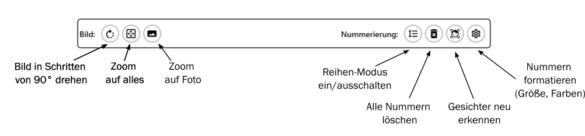

### 5.1 Navigating the Image Preview

- **Mouse wheel:** zoom in/out
- **Left mouse button (drag):** pan the image
- **Fit image:** fits the whole image into the visible area
- **Zoom to image:** zooms to 100% of the image resolution

Tip: If the view gets "out of place," clicking **Fit image** usually fixes it.

### 5.2 Rotating the Image

- Use the **Rotate** button in the "Image" group below the preview.
- Each click rotates the image **90° clockwise**.

Important:
- If names are already entered in the name list, a confirmation prompt appears first.
- After rotating, the image is re-evaluated (face detection runs again, if enabled).

---

## 6. Faces & Numbering

The **Numbering** tool group offers four tools: row mode, delete all, redetect faces, and formatting. They are explained in detail below.

### 6.1 Automatic Detection

If automatic face detection is enabled (see [Chapter 10](#10-settings)), AutoNumber detects faces automatically and places number labels when you open a new image. If row detection is also enabled, AutoNumber tries to number the people row by row.

- **Redetect faces:** Runs automatic detection again on the current image. Note that redetecting removes all existing number labels and names – names must be reassigned afterward.
- **Delete all:** Removes all currently placed number labels and their associated names. Useful if automatic detection produced an unsuitable result and you'd rather start over manually.

**Important note:** If names have already been entered, a confirmation prompt appears for both **Delete all** and **Redetect faces**, so that assignments aren't lost by accident.

### 6.2 Adding, Moving, and Deleting Numbers

You can edit number labels directly in the image preview with the mouse:

- **Right-click on an empty spot:** creates a new number.
- **Right-click on an existing number:** deletes that number; the remaining numbers are automatically renumbered.
- **Left-click and drag a label:** moves only that one label.
- **Hold Ctrl and drag a label:** moves all other labels by the same offset. This is handy for quickly realigning the whole numbering after a zoom or rotation, without moving each label individually.
- **Hover over a number:** shows the assigned name as a tooltip – a quick way to check the assignment without looking at the name list.

This lets you build a clean numbering even on difficult photos (blurry, angled, partially obscured) quickly.

### 6.3 Row Mode

**Row mode** (icon with row lines) replaces manually sorting numbers by row: you add or remove row boundaries, and AutoNumber numbers people automatically row by row (first row left to right, then the next, and so on).

Here's how it works:

- **Turn on row mode** (toggle button). A narrow strip with colored sections appears along the right edge of the image – each color represents a row. Matching colored lines are also drawn directly in the image to mark the row boundaries, and the number labels are colored according to their row. This lets you see at a glance which person belongs to which row. If you don't see the strip, zoom out a bit.

- A row can be removed via the trash-can icons next to the strip. To insert a new row, move the mouse over the strip: a horizontal preview line appears at the cursor position. Clicking there inserts the new row boundary. After deleting or inserting a row, the labels are automatically renumbered left to right.

- The boundary lines between rows can be adjusted directly in the image with the mouse:
   - **Dragging the line:** moves the whole row boundary in parallel.
   - **Dragging an endpoint:** tilts the boundary (useful for groups photographed slightly at an angle).

  As soon as you release the mouse button, any labels that ended up on the other side of the boundary's new position are automatically reassigned to the corresponding row and renumbered.

- Conversely, you can also drag a single label across a row boundary: it is immediately assigned to the new row, and the numbering updates accordingly.

Row mode preserves the assignment of name labels to people. You don't need to re-enter the names.

If you don't want to split the image into rows at all, simply delete all rows in row mode down to one (a single row can't be removed further). Numbers are then simply counted left to right.

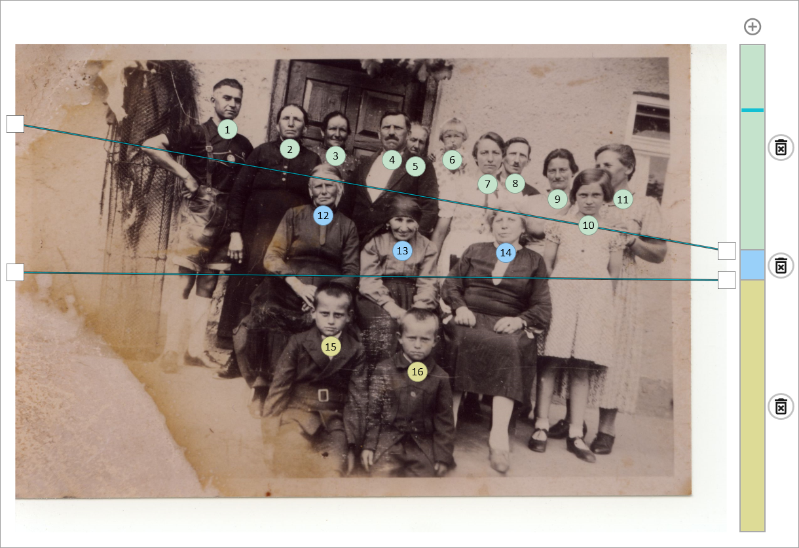

**Typical workflow for a poor detection result:**
1. "Delete all"
2. Place/move numbers manually (right-click)
3. Use row mode if needed to correct the counting order by row
4. Enter names in the list

### 6.4 Formatting

Opens the display settings for the numbers (size, font, border and background color) – analogous to the formatting dialogs for title, description, image ID, and name list (see [Chapter 8](#8-title-description-image-id)).

---

## 7. Name List

In the **Name list** area on the right:

- The *No.* column shows the image number (not editable).
- Enter the person's name in the *Name* column.
- The list is included in the preview and export.

Use the eye icon to show/hide the name list, and the gear icon to open formatting (font/colors/size). There you also set the **number of columns** (1–4) that the name list is split into in the image preview and export (JPG/PDF). The input table in the text/list area itself is unaffected and still shows only the two columns *No.* and *Name*.

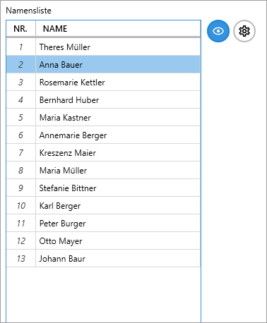

---

## 8. Title, Description, Image ID

There are dedicated fields on the right for:

- **Title**
- **Description** (image information)
- **Image ID** (e.g., an archive reference)

Each block can be individually shown/hidden via the eye icon and formatted via the gear icon. If you hide all elements including the name list, you get a plain numbered image, suitable e.g. for presentations or printing.

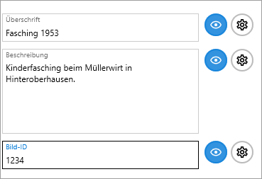

---

## 9. Saving & Export

The **File** menu offers two save commands that behave like in most other applications:

### 9.1 Save

- Writes the current edits back to the already-saved/opened file in place, with no dialog.
- On a freshly opened original photo, **Save** is disabled (greyed out) — this prevents the original from being overwritten by accident. Once the image has been saved once via **Save As...**, or an already-saved file has been reopened, **Save** becomes available.
- The file format (JPG or PDF) follows the current file and doesn't change when saving.

### 9.2 Save As...

- Opens the standard Windows Save dialog. You choose the location and file name freely; the format follows the extension you pick (`.jpg` or `.pdf`).
- Which format is preselected in the dialog is set in Settings (see [10.4](#104-export), "Default format").
- The original image file is never modified or overwritten — AutoNumber refuses to save under the original name.
- Both formats (JPG and PDF) additionally contain invisibly embedded editing data, so the saved file can later be reopened and edited again in AutoNumber (see [9.5](#95-reopening-for-editing)).

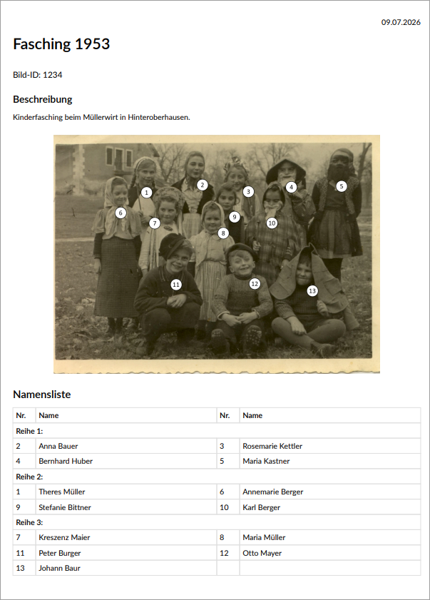

### 9.3 Custom Output Folder

In Settings (tab **Export**) you can set a custom output folder that's suggested as the location in the **Save As...** dialog — you can always pick a different location in the dialog, the output folder is only a suggestion.

- **Absolute path** (e.g. `C:\Photos\Numbered`): must already exist; best set via the "Browse..." button.
- **Relative path** (e.g. `Numbered` or `Numbered\2024`): used as a subfolder right next to the respective original photo, created automatically if needed — handy if you process photos from several different folders and want the numbered versions collected locally in a subfolder each, rather than all in one fixed folder.

### 9.4 File Name When Saving

In Settings (tab **Export**) you can additionally set a suffix that AutoNumber automatically appends to the file name (default: `_num`), keeping the original and the edited version clearly separated. An existing original is never overwritten.

### 9.5 Reopening for Editing

- Already-edited files (JPG, PDF) can be reloaded and edited further at any time via **File → Open...**.
- Layout, element visibility, font sizes, and name assignments are restored.
- Since it's no longer the original photo, **Save** is available immediately afterward.

---

## 10. Settings

Open **Settings** via **File → Settings...**. The dialog is organized into four tabs. Values set here are defaults for new images and never override the values of an already-edited (saved) image.

For most users the built-in defaults work fine – checking Settings is mainly worthwhile if you're processing a series of similar photos and want to set your own default sizes/colors once.

### 10.1 Formatting

AutoNumber automatically computes a base font size from the image's resolution and dimensions when it's loaded. The sliders in this tab each set a factor relative to that base (100% = base size).

For each of the following blocks you can set font size, font color, and background color; for numbers, also the border color:

- Numbers (incl. border color)
- Title
- Description
- Image ID
- Name list

The **"Apply to current image"** button immediately applies all default values set here to the currently open image.

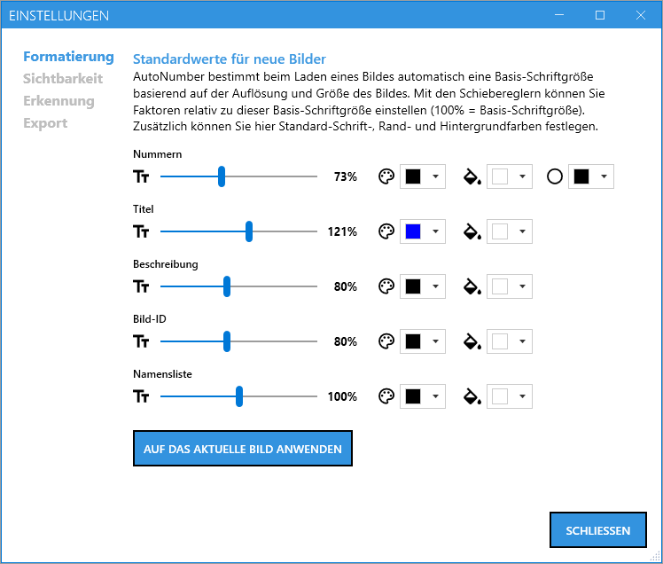

### 10.2 Visibility

Sets which elements are visible by default on newly opened images:

- Show title
- Show description
- Show image ID
- Show name list

These settings only affect new images; visibility can be adjusted per image at any time via the eye icons in the text/list area. The **"Apply"** button immediately applies the chosen defaults to the currently open image.

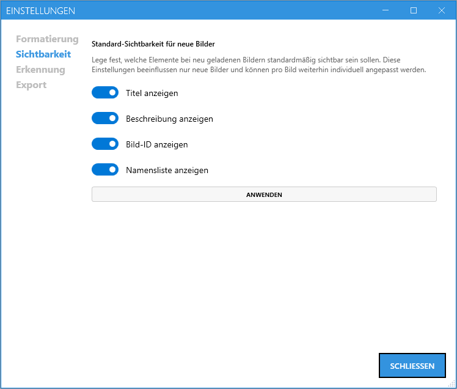

### 10.3 Detection

This tab controls automatic face detection for newly opened images:

- **Use face detection:** turns automatic detection on opening on/off. If disabled, row detection can't be enabled either.
- **Use row detection:** additionally tries to derive rows automatically from the detected faces.

**Label position on the face:** A 3×3 grid sets where the number label is centered within the detected face (e.g., top-left, center, bottom-right) – the default is "bottom center" (slightly below the chin). This setting only affects newly detected faces; already-placed labels are not moved. The **"Redetect"** button right next to it lets you immediately re-run detection with the new position.

Face detection runs entirely locally on your computer: no images or data are ever sent over the internet, and no internet connection is required. AutoNumber uses a proven method from the OpenCV image-processing library that's specialized for face detection. It reliably detects faces even in old or scanned photos – with turned heads, small or blurry faces, and uneven lighting. The detection threshold is fixed at a value that works well for the vast majority of photos, and is therefore not adjustable in Settings.

For technically interested users: a detailed explanation of the method is available in the official [OpenCV documentation on YuNet](https://docs.opencv.org/4.x/df/d20/classcv_1_1FaceDetectorYN.html).

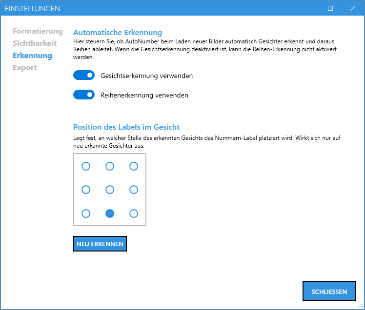

### 10.4 Export

- **Default format for "Save As":** JPG or PDF — sets which format is preselected in the Save As dialog (see [9.2](#92-save-as)).
- **Suffix for saved files:** automatically appended to the file name when saving (default: `_num`), e.g. also `revision_01` or empty for no suffix.
- **Use custom output folder:** suggests a configured folder instead of the photo's own folder in the Save As dialog (absolute or relative — see [9.3](#93-custom-output-folder)).
- **CSV (Excel) data** / **JSON data:** enables the additional metadata export when saving (see [Chapter 11](#11-csvjson-metadata-export)).

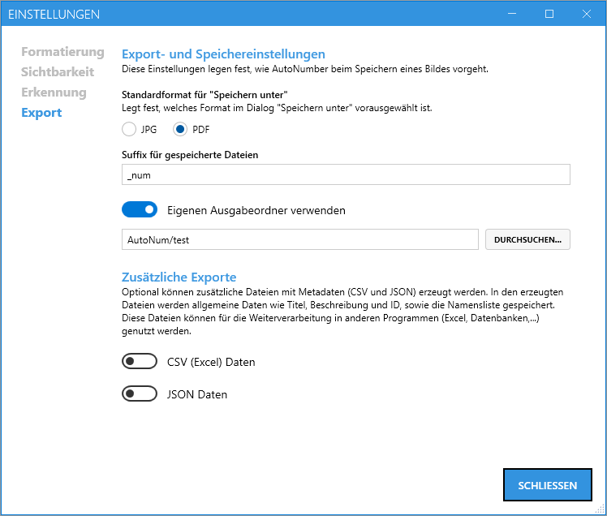

---

## 11. CSV/JSON Metadata Export

There are two ways to get metadata as a separate `.csv` or `.json` file:

- **Automatically when saving:** Enable "CSV (Excel) data" and/or "JSON data" in Settings (tab **Export**). From then on, every **Save** and **Save As...** additionally generates a same-named `.csv` and/or `.json` file alongside the image/PDF file.
- **On demand, independent of saving:** Choose **File → Export Metadata...**. A Save dialog opens where you choose the location and file name; whether a CSV or JSON file is created follows the extension you pick. This path is independent of the toggles in Settings — handy if, say, you only updated the name list and don't want to re-save the image just for that.

This metadata includes:
- Title
- Description
- Image ID
- Name list (No. / Name)

**Use case (further processing):**
The metadata can be further processed in **Excel**, **databases**, or other applications.

Example:
- You search a database or Excel table for a name.
- The result gives you the **image ID** of the photo that person appears in.
- Using the associated **number** in the image, you can uniquely identify the person in the photo.

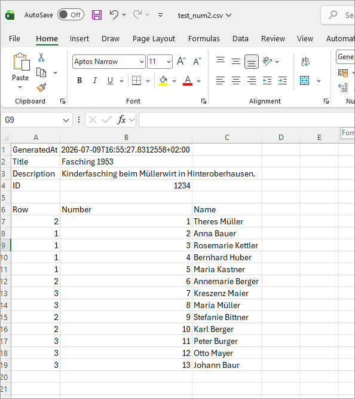

*The exported CSV file, opened in Excel.*

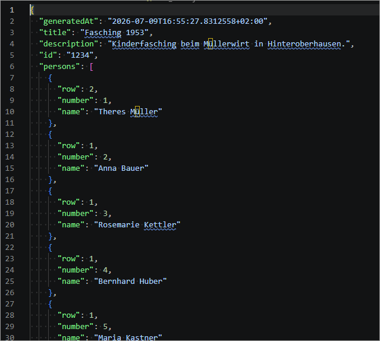

*The exported JSON file, opened in a text/code editor.*

Note:
- For plain viewing, printing, or simple sharing, you can also save without metadata export.
- For analysis, archiving, and structured search, exporting **with** metadata is recommended.

---

## 12. Tips for Genealogy Research

- Finish working on the photo before entering names: first the **orientation** (rotate), then set up **row mode** if needed and fine-tune the number label positions. Row mode and label positions can still be changed later, but it's more efficient to do this before assigning names.
- Use the **image ID** for references (archive, album page, source).
- Use short, clear name forms (e.g., "Anna Müller, b. 1904").
- Save intermediate steps as an editable file (PDF) if you're still uncertain about some people.
- Hover the mouse over a number to see the assigned name as a tooltip – a quick way to check assignments, especially on photos with many people.

---

## 13. Frequently Asked Questions (FAQ)

**Faces weren't detected – what now?**
- Check the orientation and image quality.
- Use "Redetect faces."
- If the result is still unsuitable: "Delete all" and place numbers manually.

**The numbering order doesn't match the rows in the photo?**
- Use row mode (see [6.3](#63-row-mode)) to set row boundaries directly in the image.

**The name list looks too small/large?**
- Open the name list's formatting dialog (gear icon) and adjust the size.

**Why does a warning appear before rotating/deleting/redetecting?**
- To prevent already-entered names from being lost accidentally.

---

## 14. Installation

AutoNumber is available for download on the [GitHub releases page](https://github.com/luni64/AutoNum/releases). Each version offers two download options:

1. **ZIP archive (portable):** Download the ZIP file and extract it to any folder on your PC. Then start AutoNumber by double-clicking `AutoNum.exe` – no installation required.
2. **Installer:** Download the setup file (`.exe`) and run it. The installer sets up AutoNumber like a regular Windows application, including a Start menu entry.

Both options contain the same program version – which one you choose is purely a matter of preference. The ZIP archive is handy, for example, for running from a USB stick without leaving traces on the PC; the installer is more convenient for permanent use on a PC.

---

## 15. Appendix

### 15.1 Keyboard and Mouse Quick Reference

| Action | Control |
|---|---|
| Pan image | Drag with left mouse button |
| Zoom | Mouse wheel |
| New number label | Right-click on empty image area |
| Delete number label | Right-click on existing label |
| Move all labels together | Ctrl + drag label |
| Move row boundary | Drag the line |
| Tilt row boundary | Drag an endpoint |
| Save | Ctrl+S |

### 15.2 Version Note

This manual describes AutoNumber V2.3. It will be extended with more screenshots and examples as needed.
