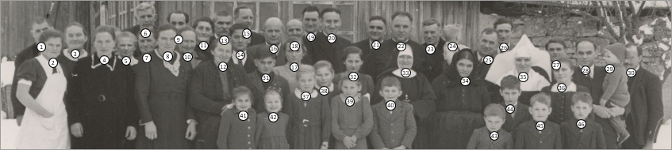

# AutoNumber – Benutzerhandbuch

*[English version](MANUAL_EN.md)*

## 1. Einführung

AutoNumber hilft Ihnen dabei,

- Gesichter auf Fotos automatisch zu erkennen und mit Nummern zu versehen,
- Nummern manuell direkt auf dem Bild zu platzieren,
- eine passende Namensliste zu pflegen,
- und das Ergebnis als **JPG** oder **bearbeitbares PDF** zu speichern.

So können Sie Familienfotos, Klassenbilder oder Gruppenaufnahmen schnell aufbereiten.

---

## 2. Oberfläche im Überblick

Oben im Fenster befindet sich die Menüleiste mit den Menüs **Datei** und **Hilfe**. Darunter besteht die Oberfläche aus zwei Bereichen:

1. **Links: Bildvorschau**
   - Hier sehen Sie das Foto mit Nummern und Zusatztexten.
   - Unten befinden sich Aktionsgruppen **Bild** (Drehen, Zoom) und **Nummerierung** (Reihenmodus, Alle löschen, Gesichter neu erkennen, Formatieren).

2. **Rechts: Text- und Listenbereich**
   - Überschrift
   - Beschreibung/Bildinformation
   - Bild-ID
   - Namensliste (Nr. / Name)

Jeder Block rechts hat ein Augen-Symbol zum Ein-/Ausblenden und ein Zahnrad-Symbol zum Formatieren.

Das Menü **Datei** enthält alle Aktionen zum Öffnen, Speichern und Exportieren (siehe [Kapitel 4](#4-bild-öffnen) und [Kapitel 9](#9-speichern--export)) sowie den Zugang zu den **Einstellungen** (siehe [Kapitel 10](#10-einstellungen)). Das Menü **Hilfe** verlinkt auf dieses Handbuch.

---

## 3. Schnellstart

1. **Datei → Öffnen...** wählen und ein Bild auswählen.
2. Bei Bedarf das Bild mit **Drehen** (Button unter der Vorschau) korrekt ausrichten.
3. Gesichter werden automatisch erkannt und nummeriert.
4. In der **Namensliste** rechts die Namen zu den Nummern eintragen.
5. Optional Überschrift, Beschreibung und Bild-ID ergänzen.
6. Das Ergebnis über **Datei → Speichern unter...** als **JPG** oder **PDF** speichern.

---

## 4. Bild öffnen

- Wählen Sie **Datei → Öffnen...**.
- Unterstützte Formate: JPG, PDF, PNG, TIFF, BMP, GIF.
- Nach dem Öffnen startet die Gesichtserkennung automatisch (sofern in den Einstellungen aktiviert).
- Bereits mit AutoNumber bearbeitete JPG- oder PDF-Dateien können ebenfalls hier geöffnet werden – Layout, Sichtbarkeit und Schriftgrößen werden dabei wiederhergestellt (siehe [Kapitel 9](#9-speichern--export)).

---

## 5. Werkzeugleiste

Unter der Bildvorschau befinden sich zwei Werkzeuggruppen: **Bild** (Zoom und Drehen) und **Nummerierung** (Reihenmodus, Alle löschen, Gesichter neu erkennen, Formatieren). Dieses Kapitel behandelt die Gruppe **Bild**; die Nummerierungs-Werkzeuge werden ausführlich in [Kapitel 6](#6-gesichter--nummerierung) erklärt.

<!-- Zeigt: die Bild- und Nummerierungs-Werkzeugleiste unter der Vorschau, alle Icons sichtbar -->

### 5.1 Navigation in der Bildvorschau

- **Mausrad:** Ein-/Auszoomen
- **Linke Maustaste (ziehen):** Bild verschieben
- **Zoom auf Bild einpassen:** passt das ganze Bild in den sichtbaren Bereich ein
- **Zoom auf Bild:** zoomt auf 100 % der Bildauflösung

Tipp: Wenn die Ansicht „verrutscht“ ist, hilft meist ein Klick auf **Zoom auf Bild einpassen**.

### 5.2 Bild drehen

- Nutzen Sie den **Drehen-Button** in der Gruppe „Bild“ unter der Bildvorschau.
- Jeder Klick dreht das Bild um **90° im Uhrzeigersinn**.

Wichtig:
- Wenn bereits Namen in der Namensliste eingetragen sind, erscheint vorher eine Sicherheitsabfrage.
- Nach dem Drehen wird das Bild neu ausgewertet (Gesichtserkennung läuft erneut, sofern aktiviert).

---

## 6. Gesichter & Nummerierung

Die Werkzeuggruppe **Nummerierung** bietet vier Werkzeuge: Reihenmodus, Alle löschen, Gesichter neu erkennen und Formatieren. Sie werden im Folgenden im Detail erklärt.

### 6.1 Automatische Erkennung

Wenn die automatische Gesichtserkennung aktiviert ist (siehe [Kapitel 10](#10-einstellungen)), erkennt AutoNumber beim Öffnen eines neuen Bildes Gesichter automatisch und setzt Nummern-Label. Ist zusätzlich die Reihenerkennung aktiv, versucht AutoNumber, die Personen reihenweise zu nummerieren.

- **Gesichter neu erkennen:** Startet die automatische Erkennung erneut auf dem aktuellen Bild. Bitte beachten Sie, dass eine erneute Erkennung alle bestehenden Nummern-Labels und Namen entfernt – die Namen müssen anschließend erneut zugeordnet werden.
- **Alle löschen:** Entfernt alle aktuell gesetzten Nummern-Label und die zugehörigen Namen. Sinnvoll, wenn die automatische Erkennung ein unpassendes Ergebnis geliefert hat und Sie lieber sauber manuell starten möchten.

**Wichtiger Hinweis:** Wenn bereits Namen eingetragen sind, erscheint bei **Alle löschen** und **Gesichter neu erkennen** eine Sicherheitsabfrage, damit keine Zuordnungen versehentlich verloren gehen.

### 6.2 Nummern setzen, verschieben und löschen

Direkt in der Bildvorschau können Sie die Nummern-Label mit der Maus bearbeiten:

- **Rechte Maustaste auf freie Stelle:** erzeugt eine neue Nummer.
- **Rechte Maustaste auf bestehende Nummer:** löscht diese Nummer; die übrigen Nummern werden automatisch neu durchgezählt.
- **Linke Maustaste auf einem Label ziehen:** verschiebt nur dieses eine Label.
- **Strg gedrückt halten und ein Label ziehen:** verschiebt alle anderen Label um denselben Versatz mit. Das ist praktisch, um die gesamte Nummerierung nach einem Zoom oder einer Drehung schnell neu auszurichten, ohne jedes Label einzeln zu verschieben.
- **Mauszeiger über einer Nummer halten:** zeigt den zugeordneten Namen als Tooltip an – praktisch, um die Namenszuordnung schnell zu prüfen, ohne in der Namensliste nachzusehen.

So können Sie auch bei schwierigen Fotos (unscharf, seitlich, teilweise verdeckt) schnell eine saubere Nummerierung aufbauen.

### 6.3 Reihenmodus

Der **Reihenmodus** (Icon mit Reihenlinien) ersetzt das manuelle Sortieren der Nummern nach Reihen: Sie fügen Reihengrenzen ein oder entfernen sie, und AutoNumber nummeriert automatisch reihenweise (erste Reihe von links nach rechts, dann die nächste usw.).

**Reihenfolge der Reihen:** Standardmäßig beginnt die Zählung bei der **obersten** Reihe. Auf vielen alten Gruppenfotos – Schulklassen, Vereinen, Hochzeitsgesellschaften – sind die Namen jedoch von der vordersten Reihe aus überliefert. Deshalb lässt sich die Richtung umstellen, sodass mit der **untersten** Reihe begonnen wird. Innerhalb einer Reihe wird in beiden Fällen von links nach rechts gezählt. Sie stellen die Richtung als Standard für neu geöffnete Bilder in den Einstellungen ein (siehe [10.3](#103-erkennung)) oder nur für das aktuell geöffnete Bild im Formatierungsdialog der Nummern (siehe [6.4](#64-formatieren)).

So funktioniert es:

- **Reihenmodus einschalten** (Toggle-Button). Am rechten Bildrand erscheint ein schmaler Streifen mit farbigen Abschnitten – jede Farbe steht für eine Reihe. Passend dazu werden die Reihengrenzen als farbige Linien direkt im Bild eingezeichnet, und die Nummern-Label werden entsprechend ihrer Reihe eingefärbt. So sehen Sie auf einen Blick, welche Person zu welcher Reihe gehört. Falls Sie den Streifen nicht sehen, zoomen Sie das Bild etwas heraus.

- Eine Reihe kann über die Papierkorb-Symbole rechts neben dem Streifen entfernt werden. Um eine neue Reihe einzufügen, bewegen Sie den Mauszeiger über den Streifen: An der Mausposition erscheint eine horizontale Vorschaulinie. Ein Klick an dieser Stelle fügt dort die neue Reihengrenze ein. Nach dem Löschen oder Einfügen einer Reihe werden die Label automatisch aufsteigend von links nach rechts nummeriert.

- Die Grenzlinien zwischen den Reihen lassen sich direkt im Bild per Maus anpassen:
   - **Ziehen der Linie:** verschiebt die ganze Reihengrenze parallel.
   - **Ziehen an einem Endpunkt:** kippt die Grenze (nützlich bei leicht schräg fotografierten Gruppen).

  Sobald Sie die Maustaste loslassen, werden alle Label, die durch die neue Position der Grenze auf die andere Seite gerutscht sind, automatisch der entsprechenden Reihe zugeordnet und neu nummeriert.

- Umgekehrt können Sie auch ein einzelnes Label über eine Reihengrenze ziehen: Es wird dabei sofort der neuen Reihe zugeordnet und die Nummerierung aktualisiert sich entsprechend.

Der Reihenmodus erhält die Zuordnung der Namens-Label zu den Personen. Sie müssen die Namen also nicht erneut eintragen.

Wenn Sie das Bild gar nicht in Reihen aufteilen möchten, löschen Sie im Reihenmodus einfach alle Reihen bis auf eine (eine einzelne Reihe lässt sich nicht mehr entfernen). Die Nummern werden dann schlicht von links nach rechts durchgezählt.

<!-- Zeigt: Reihenmodus aktiv, farbiger Streifen am rechten Bildrand, 2-3 farbige Reihengrenzen direkt im Bild, Nummern-Label entsprechend ihrer Reihe eingefärbt -->

**Typischer Arbeitsweg bei schlechtem Erkennungsergebnis:**
1. „Alle löschen“
2. Nummern manuell setzen/verschieben (rechte Maustaste)
3. Bei Bedarf Reihenmodus nutzen, um die Zählreihenfolge reihenweise zu korrigieren
4. Namen in der Liste eintragen

### 6.4 Formatieren

Öffnet die Darstellungseinstellungen für die Nummern (Größe, Schriftart, Rand- und Hintergrundfarbe) – analog zu den Formatierungsdialogen von Überschrift, Beschreibung, Bild-ID und Namensliste (siehe [Kapitel 8](#8-überschrift-beschreibung-bild-id)).

Zusätzlich enthält dieser Dialog ein 3x3-Raster **Position des Labels im Gesicht**, mit dem Sie festlegen, an welcher Stelle des erkannten Gesichts das Nummern-Label zentriert wird. Anders als in den Einstellungen (siehe [Kapitel 10.3](#103-erkennung)) wirkt sich die Auswahl hier nur auf das **aktuell geöffnete Bild** aus und ändert nicht den Standardwert für künftig geöffnete Bilder. Über den Button **„Neu Erkennen"** direkt daneben wiederholen Sie die Gesichtserkennung mit der gewählten Position; sind bereits Namen eingetragen, erscheint vorher dieselbe Sicherheitsabfrage wie unter [6.1](#61-automatische-erkennung). Über **„Als Standard übernehmen"** lässt sich die aktuelle Auswahl – wie auch Größe und Farben – als neuer Standardwert für künftig geöffnete Bilder speichern.

Darunter finden Sie das Kontrollkästchen **„Mit der untersten Reihe beginnen"** (siehe [6.3](#63-reihenmodus)). Es gilt nur für das **aktuell geöffnete Bild**; im Gegensatz zur Label-Position wirkt es sofort: Die Nummern werden unmittelbar neu vergeben, und die Namensliste zieht direkt nach – ein „Neu Erkennen" ist dafür nicht nötig und die eingetragenen Namen bleiben erhalten. Die gewählte Richtung wird beim Speichern **im Bild mitgespeichert**: Öffnen Sie das Bild später wieder, behält es seine Nummerierung, auch wenn der Standardwert inzwischen ein anderer ist.

---

## 7. Namensliste

Rechts im Bereich **Namensliste**:

- Spalte *Nr.* zeigt die Bildnummer (nicht editierbar).
- In die Spalte *Name* tragen Sie die Person ein.
- Die Liste wird in Vorschau und Export übernommen.

Über das Augen-Symbol blenden Sie die Namensliste ein/aus, über das Zahnrad-Symbol öffnen Sie die Formatierung (Schrift/Farben/Größe). Dort legen Sie auch die **Zahl der Spalten** (1–4) fest, in die die Namensliste in der Bildvorschau und im Export (JPG/PDF) aufgeteilt wird. Die Eingabetabelle im Text-/Listenbereich bleibt davon unverändert und zeigt weiterhin nur die zwei Spalten *Nr.* und *Name*.

<!-- Zeigt: rechte Spalte mit ausgefüllter Namensliste, Augen- und Zahnrad-Icon sichtbar -->

---

## 8. Überschrift, Beschreibung, Bild-ID

Rechts stehen eigene Felder für:

- **Überschrift**
- **Beschreibung** (Bildinformation)
- **Bild-ID** (z. B. Archivsignatur)

Jeder Block kann separat über das Augen-Symbol ein- oder ausgeblendet und über das Zahnrad-Symbol formatiert werden. Wenn Sie alle Elemente einschließlich der Namensliste ausblenden, erhalten Sie ein reines Bild mit Nummern, das sich z. B. für Präsentationen oder den Druck eignet.

<!-- Zeigt: rechte Spalte mit ausgefüllten Feldern für Überschrift/Beschreibung/Bild-ID -->

---

## 9. Speichern & Export

Das Menü **Datei** bietet zwei Speichern-Befehle, die sich wie in den meisten anderen Programmen verhalten:

### 9.1 Speichern

- Schreibt die aktuelle Bearbeitung ohne Dialog direkt in die bereits gespeicherte bzw. geöffnete Datei zurück.
- Bei einem frisch geöffneten Originalfoto ist **Speichern** deaktiviert (ausgegraut) – so wird verhindert, dass das Original versehentlich überschrieben wird. Sobald das Bild einmal über **Speichern unter...** gespeichert oder eine bereits gespeicherte Datei erneut geöffnet wurde, ist **Speichern** verfügbar.
- Das Dateiformat (JPG oder PDF) richtet sich nach der aktuellen Datei und ändert sich beim Speichern nicht.

### 9.2 Speichern unter...

- Öffnet den Standard-Speichern-Dialog von Windows. Sie wählen Ort und Dateinamen frei; das Format ergibt sich aus der gewählten Dateiendung (`.jpg` oder `.pdf`).
- Welches Format im Dialog vorausgewählt ist, legen Sie in den Einstellungen fest (siehe [10.4](#104-export), „Standardformat“).
- Die Original-Bilddatei wird unter keinen Umständen verändert oder überschrieben – ein Speichern unter dem Originalnamen wird von AutoNumber verweigert.
- In beiden Formaten (JPG und PDF) werden zusätzlich unsichtbar Bearbeitungsdaten eingebettet, sodass sich die gespeicherte Datei später in AutoNumber erneut öffnen und weiterbearbeiten lässt (siehe [9.5](#95-wieder-öffnen-zur-bearbeitung)).

<!-- Zeigt: exportierte PDF-Datei in einem PDF-Betrachter geöffnet -->

### 9.3 Eigener Ausgabeordner

In den Einstellungen (Tab **Export**) können Sie einen eigenen Ausgabeordner festlegen, der beim Speichern eines neuen Fotos im Dialog **Speichern unter...** als Ordner vorgeschlagen wird – Sie können im Dialog jederzeit einen anderen Ort wählen, der Ausgabeordner ist nur ein Vorschlag.

- **Absoluter Pfad** (z. B. `C:\Fotos\Nummeriert`): muss bereits existieren; wählen Sie ihn am besten über den Button „Durchsuchen...“.
- **Relativer Pfad** (z. B. `Nummeriert` oder `Nummeriert\2024`): wird als Unterordner direkt neben dem jeweiligen Originalfoto verwendet und bei Bedarf automatisch angelegt – praktisch, wenn Sie mehrere Fotos aus verschiedenen Ordnern bearbeiten und die nummerierten Versionen jeweils lokal in einem Unterordner sammeln möchten, statt alle in einem einzigen festen Ordner zu sammeln.

### 9.4 Dateiname beim Speichern

In den Einstellungen (Tab **Export**) können Sie zusätzlich ein Suffix festlegen, das AutoNumber automatisch an den Dateinamen anhängt (Standard: `_num`), damit Original und bearbeitete Version klar getrennt bleiben. Ein bereits vorhandenes Original wird dabei nie überschrieben.

### 9.5 Wieder öffnen zur Bearbeitung

- Bereits bearbeitete Dateien (JPG, PDF) können jederzeit erneut über **Datei → Öffnen...** geladen und weiterbearbeitet werden.
- Layout, Sichtbarkeit der Elemente, Schriftgrößen und Namenszuordnung werden dabei wiederhergestellt.
- Da es sich nicht mehr um das Originalfoto handelt, ist **Speichern** danach sofort verfügbar.

---

## 10. Einstellungen

Über **Datei → Einstellungen...** öffnen Sie die **Einstellungen**. Der Dialog ist in vier Tabs gegliedert. Die hier festgelegten Werte sind Standardwerte für neue Bilder und überschreiben nie die Werte eines bereits bearbeiteten (gespeicherten) Bildes.

Für die meisten Nutzer reichen die mitgelieferten Standardwerte aus – ein Blick in die Einstellungen lohnt sich vor allem, wenn Sie viele ähnliche Fotos in Serie bearbeiten und einmalig eigene Standardgrößen/-farben festlegen möchten.

### 10.1 Formatierung

AutoNumber berechnet beim Laden eines Bildes automatisch eine Basis-Schriftgröße aus Auflösung und Größe des Bildes. Die Schieberegler in diesem Tab setzen jeweils einen Faktor relativ zu dieser Basis (100 % = Basisgröße).

Für jeden der folgenden Blöcke lassen sich Schriftgröße, Schriftfarbe und Hintergrundfarbe festlegen; bei den Nummern zusätzlich die Randfarbe:

- Nummern (inkl. Randfarbe)
- Titel
- Beschreibung
- Bild-ID
- Namensliste

Der Button **„Auf das aktuelle Bild anwenden"** überträgt alle hier eingestellten Standardwerte sofort auf das gerade geöffnete Bild.

<!-- Zeigt: Formatierung-Tab mit den Schriftgrößen-/Farbreglern für Nummern, Titel, Beschreibung, Bild-ID, Namensliste -->

### 10.2 Sichtbarkeit

Legt fest, welche Elemente bei neu geöffneten Bildern standardmäßig sichtbar sind:

- Titel anzeigen
- Beschreibung anzeigen
- Bild-ID anzeigen
- Namensliste anzeigen

Diese Einstellungen wirken sich nur auf neue Bilder aus; die Sichtbarkeit lässt sich pro Bild jederzeit über die Augen-Symbole im Text-/Listenbereich individuell anpassen. Der Button **„Anwenden"** überträgt die gewählten Standardwerte sofort auf das gerade geöffnete Bild.

<!-- Zeigt: Sichtbarkeit-Tab mit den vier Toggle-Switches -->

### 10.3 Erkennung

Dieser Tab steuert die automatische Gesichtserkennung für neu geöffnete Bilder:

- **Gesichtserkennung verwenden:** schaltet die automatische Erkennung beim Öffnen ein/aus. Ist sie deaktiviert, lässt sich auch die Reihenerkennung nicht aktivieren.
- **Reihenerkennung verwenden:** versucht zusätzlich, Reihen automatisch aus den erkannten Gesichtern abzuleiten.
- **Mit der untersten Reihe beginnen:** legt den **Standardwert** für die Zählrichtung neu geöffneter Bilder fest (siehe [6.3](#63-reihenmodus)). Ist der Schalter aus, beginnt die Nummerierung wie bisher bei der obersten Reihe; ist er ein, bei der untersten. Innerhalb einer Reihe wird immer von links nach rechts gezählt. Wie die Label-Position wirkt sich auch diese Änderung nicht auf ein bereits geöffnetes Bild aus – dafür nutzen Sie den Formatierungsdialog der Nummern (siehe [6.4](#64-formatieren)).

**Position des Labels im Gesicht:** Ein 3x3-Raster legt den **Standardwert** fest, an welcher Stelle des erkannten Gesichts das Nummern-Label bei neu geöffneten Bildern zentriert wird (z. B. oben links, Mitte, unten rechts) – der Standard ist „Unten Mitte" (leicht unterhalb des Kinns). Wie bei allen anderen Werten auf dieser Seite wird die Auswahl sofort als Standardwert gespeichert; es gibt hier keinen „Neu Erkennen"-Button, da sich die Änderung nicht auf ein bereits geöffnetes Bild auswirkt. Um die Position für das **aktuell geöffnete Bild** anzupassen und die Gesichter damit neu zu erkennen, nutzen Sie stattdessen den Formatierungsdialog der Nummern-Label (siehe [Kapitel 6.4](#64-formatieren)).

Die Gesichtserkennung läuft vollständig lokal auf Ihrem Rechner: Es werden keine Bilder oder Daten über das Internet verschickt, und es ist keine Internetverbindung erforderlich. AutoNumber nutzt dafür ein bewährtes Verfahren aus der Bildverarbeitungsbibliothek OpenCV, das speziell auf die Erkennung von Gesichtern spezialisiert ist. Es erkennt Gesichter auch auf alten oder gescannten Fotos zuverlässig – bei seitlicher Kopfhaltung, kleinen oder unscharfen Gesichtern und ungleichmäßiger Beleuchtung. Die Erkennungsschwelle ist fest auf einen Wert eingestellt, der für die allermeisten Fotos gute Ergebnisse liefert, und daher nicht über die Einstellungen veränderbar.

Für Nutzer mit technischem Interesse: eine ausführliche Erklärung des Verfahrens findet sich im offiziellen [OpenCV-Beitrag zu YuNet](https://docs.opencv.org/4.x/df/d20/classcv_1_1FaceDetectorYN.html).

<!-- Zeigt: Erkennung-Tab mit Gesichts-/Reihenerkennung-Toggles, 3x3-Anker-Raster und dem Schalter "Mit der untersten Reihe beginnen" (ohne "Neu Erkennen"-Button). TODO: Screenshot ist veraltet — er zeigt noch den alten Button und seit V2.4.0 auch den Nummerierungs-Schalter nicht, muss neu aufgenommen werden. -->

### 10.4 Export

- **Standardformat für „Speichern unter“:** JPG oder PDF – legt fest, welches Format im Speichern-unter-Dialog vorausgewählt ist (siehe [9.2](#92-speichern-unter)).
- **Suffix für gespeicherte Dateien:** wird beim Speichern automatisch an den Dateinamen angehängt (Standard: `_num`), z. B. auch `revision_01` oder leer für kein Suffix.
- **Eigenen Ausgabeordner verwenden:** schlägt beim Speichern unter... einen festgelegten Ordner statt des Fotoordners vor (absolut oder relativ – siehe [9.3](#93-eigener-ausgabeordner)).
- **CSV (Excel) Daten** / **JSON Daten:** aktiviert den zusätzlichen Metadaten-Export beim Speichern (siehe [Kapitel 11](#11-csvjson-metadaten-export)).

---

## 11. CSV/JSON-Metadaten-Export

Es gibt zwei Wege, Metadaten als eigene `.csv`- oder `.json`-Datei zu erhalten:

- **Automatisch beim Speichern:** Aktivieren Sie in den Einstellungen (Tab **Export**) „CSV (Excel) Daten“ und/oder „JSON Daten“. Ab dann wird bei jedem **Speichern** und **Speichern unter...** zusätzlich zur Bild-/PDF-Datei automatisch eine gleichnamige `.csv`- bzw. `.json`-Datei erzeugt.
- **Auf Wunsch, unabhängig vom Speichern:** Wählen Sie **Datei → Metadaten exportieren...**. Es öffnet sich ein Speichern-Dialog, in dem Sie Ort und Dateinamen wählen; ob eine CSV- oder JSON-Datei entsteht, ergibt sich aus der gewählten Dateiendung. Dieser Weg ist unabhängig von den Toggles in den Einstellungen – praktisch, wenn Sie z. B. nur die Namensliste aktualisiert haben und dafür nicht extra das Bild neu speichern möchten.

Diese Metadaten enthalten:
- Titel
- Beschreibung
- Bild-ID
- Namensliste (Nr. / Name)

**Anwendungsfall (Weiterverarbeitung):**
Die Metadaten können in **Excel**, **Datenbanken** oder anderen Anwendungen weiterverarbeitet werden.

Beispiel:
- Sie suchen in einer Datenbank oder Excel-Tabelle nach einem Namen.
- Als Ergebnis erhalten Sie die **Bild-ID** des Fotos, auf dem die Person vorkommt.
- Über die zugehörige **Nummer** im Bild können Sie die Person im Foto eindeutig zuordnen.

*Die exportierte CSV-Datei, geöffnet in Excel.*
<!-- Zeigt: exportierte CSV-Datei in Excel geöffnet -->

*Die exportierte JSON-Datei, geöffnet in einem Text-/Code-Editor.*
<!-- Zeigt: exportierte JSON-Datei in einem Text-/Code-Editor -->

Hinweis:
- Für reine Ansicht, Druck oder einfache Weitergabe können Sie auch ohne Metadaten-Export speichern.
- Für Auswertung, Archivierung und strukturierte Suche ist der Export **mit** Metadaten empfehlenswert.

---

## 12. Tipps für die Ahnenforschung

- Arbeiten Sie das Foto zuerst komplett auf, bevor Sie Namen eintragen: zunächst die **Ausrichtung** (Drehen), danach bei Bedarf den **Reihenmodus** einrichten und die Positionen der Nummern-Label feinjustieren. Reihenmodus und Label-Positionen lassen sich zwar auch später noch ändern, aber es ist effizienter, das vor der Namenszuordnung zu erledigen.
- Nutzen Sie die **Bild-ID** für Signaturen (Archiv, Albumseite, Quelle).
- Verwenden Sie kurze, klare Namensformen (z. B. „Anna Müller, geb. 1904“).
- Speichern Sie Zwischenschritte als bearbeitbare Datei (PDF), wenn noch Unsicherheiten bei Personen bestehen.
- Halten Sie den Mauszeiger über eine Nummer, um den zugeordneten Namen als Tooltip zu sehen – so prüfen Sie die Zuordnung schnell, gerade bei Fotos mit vielen Personen.

---

## 13. Häufige Fragen (FAQ)

**Gesichter wurden nicht erkannt – was tun?**
- Prüfen Sie Ausrichtung und Bildqualität.
- Nutzen Sie „Gesichter neu erkennen“.
- Wenn das Ergebnis weiter unpassend ist: „Alle löschen“ und Nummern manuell setzen.

**Die Nummerierungsreihenfolge passt nicht zu den Reihen im Foto?**
- Nutzen Sie den Reihenmodus (siehe [6.3](#63-reihenmodus)), um Reihengrenzen direkt im Bild festzulegen.
- Soll die Zählung bei der vordersten statt bei der obersten Reihe beginnen, aktivieren Sie „Mit der untersten Reihe beginnen" – für das aktuelle Bild im Formatierungsdialog der Nummern (siehe [6.4](#64-formatieren)), als Standard für neue Bilder in den Einstellungen (siehe [10.3](#103-erkennung)).

**Namensliste wirkt zu klein/groß?**
- Öffnen Sie den Formatierungsdialog der Namensliste (Zahnrad-Symbol) und passen Sie die Größe an.

**Warum kommt eine Warnung vor dem Drehen/Löschen/Neu erkennen?**
- Damit bereits eingetragene Namen nicht versehentlich verloren gehen.

---

## 14. Installation

AutoNumber steht auf der [GitHub-Releases-Seite](https://github.com/luni64/AutoNum/releases) zum Download bereit. Dort finden Sie zu jeder Version zwei Download-Möglichkeiten:

1. **ZIP-Archiv (portabel):** Laden Sie die ZIP-Datei herunter und entpacken Sie sie in einen beliebigen Ordner auf Ihrem PC. Starten Sie AutoNumber anschließend durch Doppelklick auf `AutoNum.exe` – es ist keine Installation nötig.
2. **Installer:** Laden Sie die Setup-Datei (`.exe`) herunter und führen Sie sie aus. Der Installer richtet AutoNumber wie eine gewöhnliche Windows-Anwendung ein, inklusive Startmenü-Eintrag.

Beide Varianten enthalten dieselbe Programmversion – welche Sie wählen, ist reine Geschmackssache. Das ZIP-Archiv eignet sich z. B. für den Einsatz von einem USB-Stick, ohne Spuren auf dem PC zu hinterlassen; der Installer ist für die dauerhafte Nutzung auf einem PC bequemer.

---

## 15. Anhang

### 15.1 Tastatur- und Maus-Kurzreferenz

| Aktion | Bedienung |
|---|---|
| Bild verschieben | Linke Maustaste ziehen |
| Zoomen | Mausrad |
| Neues Nummern-Label | Rechtsklick auf freie Bildstelle |
| Nummern-Label löschen | Rechtsklick auf bestehendes Label |
| Alle Label gemeinsam verschieben | Strg + Label ziehen |
| Reihengrenze verschieben | Ziehen der Linie |
| Reihengrenze kippen | Ziehen an einem Endpunkt |
| Speichern | Strg+S |

### 15.2 Versionshinweis

Dieses Handbuch beschreibt AutoNumber V2.3. Es wird bei Bedarf um weitere Screenshots und Beispiele ergänzt.
